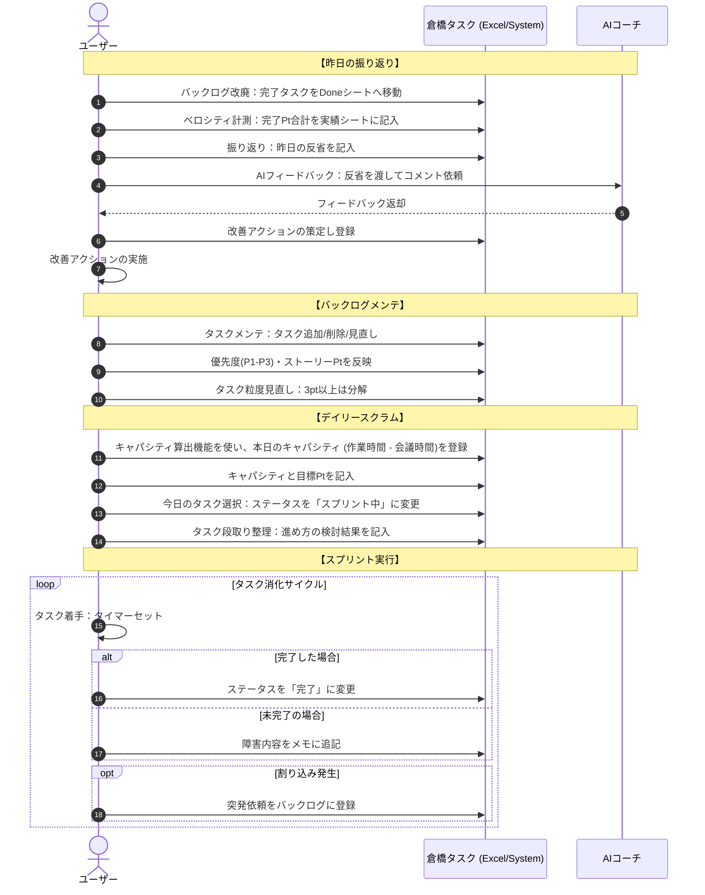

# コンセプト

## 用語定義（ドメイン）
- **実績ポイント**: 消化タスクから算出されるその日の生産性指標。
- **AIコーチング**: 実績に基づき、AIが翌日のアクションプランを提案するプロセス。
- **タスク粒度**: 思考を止めずに実行できるよう細分化された作業単位。

## 業務フロー

```mermaid
sequenceDiagram
    autonumber
    actor User as ユーザー
    participant App as 倉橋タスク (Excel/System)
    participant AI as AIコーチ

    Note over User, AI: 【昨日の振り返り】
    User->>App: バックログ改廃：完了タスクをDoneシートへ移動
    User->>App: ベロシティ計測：完了Pt合計を実績シートに記入
    User->>App: 振り返り：昨日の反省を記入
    User->>AI: AIフィードバック：反省を渡してコメント依頼
    AI-->>User: フィードバック返却
    User->>App: 改善アクションの策定し登録
    User->>User: 改善アクションの実施

    Note over User, AI: 【バックログメンテ】
    User->>App: タスクメンテ：タスク追加/削除/見直し
    User->>App: 優先度(P1-P3)・ストーリーPtを反映
    User->>App: タスク粒度見直し：3pt以上は分解

    Note over User, AI: 【デイリースクラム】
    User->>App: キャパシティ算出機能を使い、本日のキャパシティ (作業時間 - 会議時間)を登録
    User->>App: キャパシティと目標Ptを記入
    User->>App: 今日のタスク選択：ステータスを「スプリント中」に変更
    User->>App: タスク段取り整理：進め方の検討結果を記入

    Note over User, AI: 【スプリント実行】
    loop タスク消化サイクル
        User->>User: タスク着手：タイマーセット
        alt 完了した場合
            User->>App: ステータスを「完了」に変更
        else 未完了の場合
            User->>App: 障害内容をメモに追記
        end
        
        opt 割り込み発生
            User->>App: 突発依頼をバックログに登録
        end
    end
```

